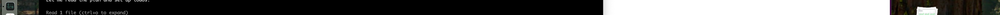
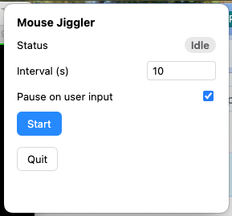

# Mouse Jiggler


A lightweight macOS menu-bar app that moves your mouse cursor at a configurable interval — keeping your machine awake and your status green.

## Screenshots

**Menu bar icon**



**Preferences popup**



## Install

**From GitHub (no clone needed):**

```bash
npm install github:jshen-avtx/mcjiggler
cd node_modules/mcjiggler
npm install
npm start
```

**Or clone and run:**

```bash
git clone https://github.com/jshen-avtx/mcjiggler
cd mcjiggler
npm install
npm start
```

## Build a distributable DMG

```bash
npm run dist
```

The `.dmg` will appear in `dist/`.

## How it works

- Sits in the macOS menu bar as a small ring icon
- Click the icon to open preferences
- Set the **Interval** — seconds between each mouse nudge
- Toggle **Pause on user input** — the jiggler auto-stops when it detects real mouse movement and resumes when you go idle again
- Settings persist across launches

## Requirements

- macOS 12 Monterey or later
- Node.js 18+
- Accessibility permission (macOS will prompt on first run — required for mouse control)
